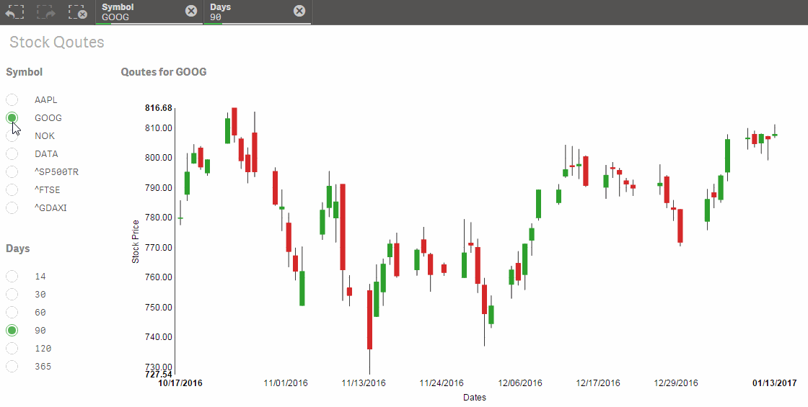
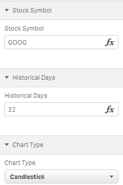

Qlik Sense Extension StockQuotes
================================

Extension to retrieve stock quotes from Yahoo! Finance: http://finance.yahoo.com/

Caution: data are for personal use only!

This extension implements NVD3 OHCL and candlestick chart:

https://nvd3-community.github.io/nvd3/examples/candlestickChart.html

### Properties:

1. Stock Symbol: ticker symbol for stock
2. Historical Days: amount of days to go back from today to retrieve quotes
3. Candlestick: switch chart type from OHCL to Candlestick

### Sample App:

Stock Data.qvf uses extension sense-FieldUI for radio button listboxes:

https://github.com/ralfbecher/sense-FieldUI

Change Load Script for other stock symbols.

## Author

**Ralf Becher**

+ [irregular.bi](http://irregular.bi)
* [twitter/irregularbi](http://twitter.com/irregularbi)
* [github.com/ralfbecher](http://github.com/ralfbecher)

## License

Copyright © 2017 Ralf Becher

Released under the MIT license.

***